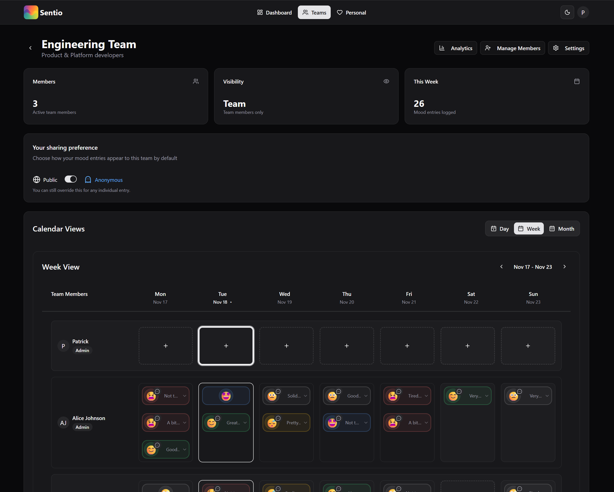
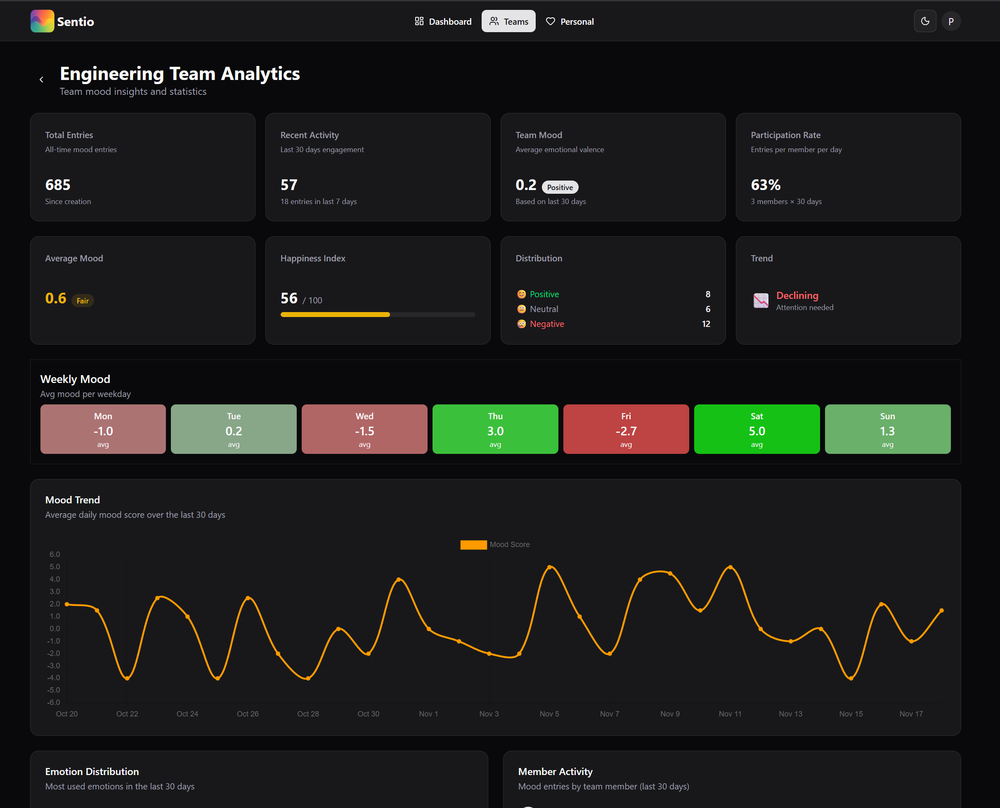

# Sentio – Team Mood Tracker

<p align="center">
  
</p>

**sentio** _[ˈsen.ti.oː]_ is Latin for "I feel" or "to perceive".

Everyone logs how they feel each day, and Sentio turns those entries into trends, insights, and early signals so teams stay healthy and connected.

Similar to a classic **Niko-Niko calendar**, but modern, visual, and built for real-world teams.

<div align="center" style="display:flex; justify-content:center; gap:16px; flex-wrap:wrap;">
   
   
</div>

## Table of Contents

- [🌟 Features](#-features)
- [🚀 Quickstart](#-quickstart)
- [⚙️ Environment Variables](#-environment-variables)
- [🔔 Reminders & Notifications](#-reminders--notifications)
- [📆 Calendar Integration](#-calendar-integration)
- [🤝 Contributing](#-contributing)

## 🌟 Features

### Mood Tracking

- One-click daily mood check-ins
- Optional comments to explain your mood
- Anonymous logging mode (per team)

### Team & Personal Views

- Team dashboards with current wellbeing
- Personal mood history and insights
- Weekly, monthly, and long-term trends
- Detect drops or recurring negative patterns

### Reminders & Notifications

- Custom recurring reminders (day + time)
- Browser push notifications
- After-event reminders (e.g. “How did that meeting feel?”)

### Integrations

- **Google Calendar** (read-only) to show events in Sentio
- Outlook / Microsoft 365 integration coming soon
- Event-based mood reminders after calendar entries

### Achievements & Gamification
- Achievement system to reward positive habits
- Achievements for activities like:
  - Logging your first mood
  - Logging moods for multiple consecutive days
  - Writing comments alongside moods
  - Reaching mood streaks (e.g., 7 days of positive moods)
- Visual achievement badges in your profile

### Team Management

- Invite members
- Configure roles and permissions
- Manage mood options (emojis, colors, labels)

## 🚀 Quickstart

Choose how you want to run Sentio:

### Option 1: Docker Compose (recommended)

You can pull the image from either:

- [Docker Hub ](https://hub.docker.com/r/padi2312/sentio)
- [GitHub Container Registry](https://github.com/p-arndt/sentio/pkgs/container/sentio)

Steps:

1. Copy `docker/.env.example` → `docker/.env`
2. Adjust your environment variables
3. Start Sentio:

   ```bash
   docker compose up -d
   ```

4. Open **[http://localhost:3000](http://localhost:3000)**

### Option 2: Local Development

```bash
git clone <repo-url>
cd sentio
pnpm install
pnpm run dev
```

Then open the dev server (usually **[http://localhost:5173](http://localhost:5173)**).

## ⚙️ Environment Variables

Use `.env` or set them directly in your environment.
Keep secrets private and secure.

### Core Settings

| Variable            | What it controls               | Example                 |
| ------------------- | ------------------------------ | ----------------------- |
| PUBLIC_ALLOW_SIGNUP | Allow or block public signup   | `false`                 |
| BETTER_AUTH_SECRET  | Secret for signing auth tokens | random hex              |
| BETTER_AUTH_URL     | URL of your Sentio instance    | `http://localhost:3000` |
| POSTGRES_HOST       | Database host                  | `localhost`             |
| POSTGRES_PORT       | Database port                  | `5432`                  |
| POSTGRES_USER       | Database user                  | `sentio`                |
| POSTGRES_PASSWORD   | Database password              | `sentio`                |
| POSTGRES_DB         | Database name                  | `sentio`                |

### Authentication

Choose between email/password or OIDC login.

| Variable            | Description                   |
| ------------------- | ----------------------------- |
| AUTH_PROVIDER       | `email` or `oidc`             |
| EMAIL_AUTH_DISABLED | Set `true` to force OIDC only |
| OIDC_CLIENT_ID      | OIDC client ID                |
| OIDC_CLIENT_SECRET  | OIDC client secret            |
| OIDC_ISSUER         | OIDC issuer URL               |

### SMTP / Email

You can set SMTP via:

- the Admin UI (saved to DB), or
- environment variables (used as defaults)

| Variable                  | Purpose        |
| ------------------------- | -------------- |
| SMTP_HOST                 | SMTP server    |
| SMTP_PORT                 | SMTP port      |
| SMTP_USER / SMTP_USERNAME | Login name     |
| SMTP_PASSWORD             | Password       |
| SMTP_FROM                 | Sender address |

> UI-configured values override the environment. Missing values fall back to the `.env`.

### Web Push / Notifications (VAPID)

| Variable                 | Purpose                      |
| ------------------------ | ---------------------------- |
| VAPID_PUBLIC_KEY         | Public VAPID key             |
| VAPID_PRIVATE_KEY        | Private VAPID key            |
| VAPID_SUBJECT            | Contact email/URL            |
| PUBLIC_GOOGLE_CLIENT_ID  | Google OAuth ID for Calendar |
| VITE_MICROSOFT_CLIENT_ID | Microsoft OAuth ID (Outlook) |

Generate VAPID keys:

```bash
pnpx web-push generate-vapid-keys
```

## 🔔 Reminders & Notifications

- Set reminders with a title, message, time, and selected weekdays
- Works across time zones
- Push notifications require valid VAPID keys
- Test notifications are available in **Settings → Notifications**

## 📆 Calendar Integration

### Google Calendar

1. Create an OAuth client in Google Cloud.
2. Add redirect URL:

   ```
   https://<your-host>/api/oauth/google/callback
   ```

3. Set `PUBLIC_GOOGLE_CLIENT_ID`
4. Go to **Settings → Calendar** and connect your account.

Sentio requests **read-only** access.

## 🤝 Contributing

- Open an issue for bigger changes
- Keep PRs focused
- Include tests when adding new behavior
- Follow formatting (`pnpm run format`)

---

Sentio helps teams better understand how they feel and react early when things change.
Simple for individuals. Powerful for teams.
